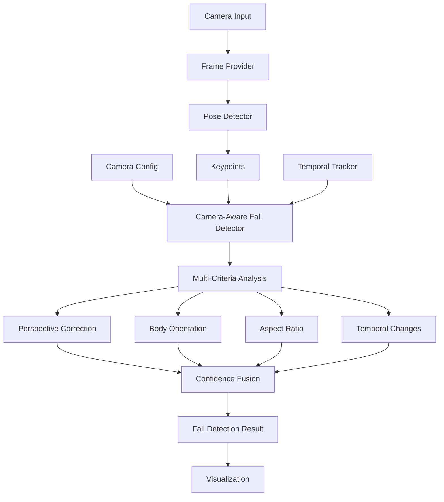
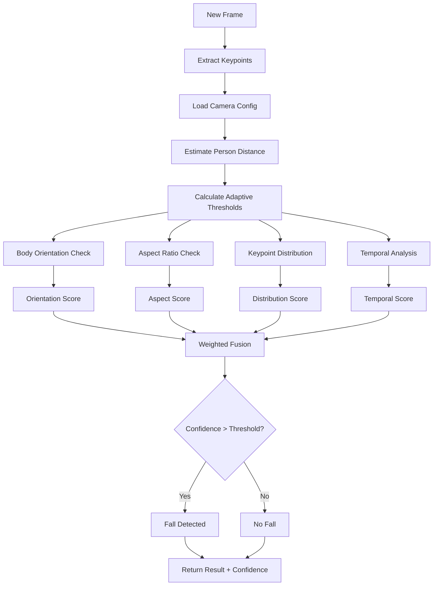

# Fall Detection Improvement Plan: Camera Height-Aware System

## Executive Summary

This document outlines the architectural plan to improve the fall detection system by incorporating camera-specific parameters (height, tilt angle, FOV) to achieve more accurate and adaptive fall detection across multiple cameras with different configurations.

## Current System Analysis

### Existing Implementation Limitations

1. **Fixed Pixel Thresholds**: Current system uses hardcoded pixel values (50px for YOLO, 0.3 normalized for MediaPipe)
   - Location: [`YOLOFallDetector.detect_fall()`](../yoloplay/fall_detector.py:50)
   - Problem: Same threshold regardless of camera distance, angle, or person's position in frame

2. **Simple Vertical Distance Check**: Only compares head-to-feet distance
   - Location: [`YOLOFallDetector`](../yoloplay/fall_detector.py:78-86)
   - Missing: Body orientation, aspect ratio, temporal changes

3. **No Camera Context**: Detection logic is camera-agnostic
   - Missing: Height compensation, perspective correction, depth estimation

4. **Single-Frame Analysis**: No temporal tracking
   - Missing: Velocity analysis, sudden position changes, fall trajectory

5. **Binary Detection**: Simple threshold-based decision
   - Missing: Multi-criteria fusion, confidence weighting, context awareness

## Proposed Architecture

### System Overview



### Core Components

#### 1. Camera Configuration System

**File**: `yoloplay/camera_config.py`

```python
class CameraConfig:
    """
    Stores camera-specific parameters for perspective-aware fall detection.
    
    Attributes:
        height_meters: Camera mounting height from ground (meters)
        tilt_angle_degrees: Camera tilt angle from horizontal (0-90°)
        horizontal_fov_degrees: Horizontal field of view (degrees)
        vertical_fov_degrees: Vertical field of view (degrees)
        image_width: Frame width in pixels
        image_height: Frame height in pixels
        camera_id: Unique identifier for the camera
    """
```

**Configuration File Format** (`config/cameras.yaml`):
```yaml
cameras:
  camera_1:
    height_meters: 2.8
    tilt_angle_degrees: 45
    horizontal_fov_degrees: 90
    vertical_fov_degrees: 60
    image_width: 1920
    image_height: 1080
    
  camera_2:
    height_meters: 1.5
    tilt_angle_degrees: 10
    horizontal_fov_degrees: 78
    vertical_fov_degrees: 52
    image_width: 1280
    image_height: 720
```

#### 2. Perspective Correction Module

**File**: `yoloplay/perspective.py`

Provides geometric transformations to:
- Convert pixel distances to real-world distances based on camera parameters
- Estimate person's distance from camera using pose keypoints
- Calculate expected body dimensions at different depths
- Adjust thresholds based on person's position in frame

**Key Functions**:
```python
def estimate_person_distance(keypoints, camera_config) -> float
def pixel_to_world_distance(pixel_dist, person_distance, camera_config) -> float
def calculate_expected_body_height(person_distance, camera_config, average_height=1.7) -> float
def get_adaptive_thresholds(keypoints, camera_config) -> dict
```

#### 3. Enhanced Fall Detector

**File**: `yoloplay/fall_detector.py` (enhanced)

**New Detection Criteria**:

1. **Body Orientation Analysis**
   - Calculate torso angle relative to vertical
   - Measure shoulder-hip alignment
   - Account for camera tilt angle

2. **Aspect Ratio Check**
   - Width-to-height ratio of bounding box
   - Expected ratio when standing vs. lying down
   - Adjusted for camera perspective

3. **Keypoint Distribution**
   - Check if keypoints are spread horizontally (fallen)
   - Vertical clustering analysis (standing)
   - Head position relative to body center

4. **Temporal Analysis**
   - Sudden drop in vertical position
   - Rapid change in body orientation
   - Acceleration/velocity of key points

5. **Camera-Adaptive Thresholds**
   - Dynamic threshold calculation based on:
     - Distance from camera
     - Position in frame (near/far from camera)
     - Camera mounting height and angle

#### 4. Temporal Tracking System

**File**: `yoloplay/temporal_tracker.py`

**Purpose**: Track person position and orientation over time

**Features**:
- Person ID tracking across frames
- Position history buffer (last N frames)
- Velocity and acceleration estimation
- Sudden change detection
- Fall trajectory analysis

```python
class PersonTracker:
    """
    Tracks a person's pose over time for temporal analysis.
    """
    def __init__(self, buffer_size=30):  # ~1 second at 30fps
        self.position_history = []
        self.orientation_history = []
        self.keypoint_history = []
    
    def update(self, keypoints, timestamp):
        """Update tracking with new frame data"""
        
    def detect_sudden_drop(self) -> Tuple[bool, float]:
        """Detect rapid vertical position change"""
        
    def calculate_velocity(self) -> np.ndarray:
        """Calculate movement velocity"""
```

### Detection Algorithm Flow



### Mathematical Models

#### 1. Distance Estimation

Using camera parameters and person's bounding box:

```
distance = (camera_height × image_height × average_person_height) / 
           (bbox_height × focal_length_pixels × sin(tilt_angle))
```

Where:
- `focal_length_pixels = image_width / (2 × tan(horizontal_fov / 2))`

#### 2. Adaptive Threshold Calculation

```python
def get_height_threshold(person_distance, camera_config):
    """
    Calculate dynamic height threshold based on perspective.
    
    Close to camera: Larger pixel threshold
    Far from camera: Smaller pixel threshold
    """
    # Base threshold for standing person at reference distance
    reference_distance = 3.0  # meters
    reference_threshold = 100  # pixels at reference distance
    
    # Scale threshold inversely with distance
    scale_factor = reference_distance / person_distance
    threshold = reference_threshold * scale_factor
    
    # Adjust for camera tilt
    tilt_factor = np.cos(np.radians(camera_config.tilt_angle_degrees))
    threshold *= tilt_factor
    
    return threshold
```

#### 3. Body Orientation Score

```python
def calculate_orientation_score(keypoints, camera_config):
    """
    Calculate how horizontal the body is (0=vertical, 1=horizontal).
    """
    # Get shoulder and hip keypoints
    shoulders = get_shoulder_midpoint(keypoints)
    hips = get_hip_midpoint(keypoints)
    
    # Calculate body vector
    body_vector = shoulders - hips
    
    # Account for camera tilt
    corrected_angle = calculate_body_angle(body_vector) - camera_config.tilt_angle_degrees
    
    # Normalize to 0-1 (0=standing, 1=lying)
    orientation_score = abs(corrected_angle) / 90.0
    
    return orientation_score
```

## Implementation Plan

### Phase 1: Core Infrastructure (Priority: High)

1. **Create Camera Configuration System** ✓
   - Implement [`CameraConfig`](../yoloplay/camera_config.py) class
   - Add YAML/JSON file loader
   - Validate configuration parameters

2. **Implement Perspective Correction** ✓
   - Distance estimation algorithm
   - Pixel-to-world conversion
   - Adaptive threshold calculator

3. **Add Configuration to Frame Providers** ✓
   - Extend [`FrameProvider`](../yoloplay/frame_providers.py:16) to include camera config
   - Add config parameter to constructors

### Phase 2: Enhanced Detection (Priority: High)

4. **Upgrade YOLOFallDetector** ✓
   - Add multi-criteria analysis
   - Implement perspective-aware thresholds
   - Add body orientation calculation
   - Implement aspect ratio check

5. **Upgrade MediaPipeFallDetector** ✓
   - Apply same improvements as YOLO detector
   - Leverage normalized coordinates

### Phase 3: Temporal Tracking (Priority: Medium)

6. **Implement Temporal Tracker** ✓
   - Person tracking across frames
   - Position/orientation history buffer
   - Velocity and acceleration calculation
   - Sudden change detection

7. **Integrate Temporal Analysis** ✓
   - Add temporal score to fall detection
   - Implement weighted fusion logic

### Phase 4: User Interface & Configuration (Priority: Medium)

8. **Update Command-Line Interface** ✓
   - Add `--camera-config` parameter
   - Add `--camera-height`, `--camera-tilt`, `--camera-fov` options
   - Support both file-based and inline configuration

9. **Enhanced Visualization** ✓
   - Show detection criteria scores
   - Display camera parameters on screen
   - Visualize adaptive thresholds
   - Show person distance estimation

### Phase 5: Testing & Documentation (Priority: Medium)

10. **Create Unit Tests** ✓
    - Test camera config loading
    - Test perspective calculations
    - Test each detection criterion
    - Test temporal tracking

11. **Update Documentation** ✓
    - Camera setup guide
    - Calibration instructions
    - Configuration examples
    - API documentation

### Phase 6: Advanced Features (Priority: Low)

12. **Optional Enhancements** ⊗
    - Multi-person tracking
    - Zone-based detection
    - Alert system integration
    - Performance optimization

## File Structure

```
yoloplay/
├── __init__.py
├── camera_config.py          # NEW: Camera configuration
├── perspective.py             # NEW: Perspective correction
├── temporal_tracker.py        # NEW: Temporal tracking
├── fall_detector.py           # MODIFIED: Enhanced detection
├── detectors.py               # MODIFIED: Accept camera config
├── frame_providers.py         # MODIFIED: Handle camera config
├── main.py                    # MODIFIED: CLI updates
└── utils.py                   # NEW: Helper functions

config/
├── cameras.yaml               # NEW: Example camera configs
└── cameras.json               # NEW: Alternative format

tests/
├── test_camera_config.py      # NEW: Config tests
├── test_perspective.py        # NEW: Perspective tests
├── test_fall_detector.py      # NEW: Enhanced detector tests
└── test_temporal_tracker.py   # NEW: Tracking tests

docs/
├── fall_detection_improvement_plan.md  # THIS FILE
├── camera_setup_guide.md               # NEW: Setup instructions
└── calibration_guide.md                # NEW: Calibration help
```

## API Changes

### YOLOFallDetector (Enhanced)

```python
class YOLOFallDetector(FallDetector):
    def __init__(self, camera_config: Optional[CameraConfig] = None):
        self.camera_config = camera_config
        self.tracker = PersonTracker() if camera_config else None
    
    def detect_fall(
        self, 
        keypoints: np.ndarray, 
        frame_time: Optional[float] = None
    ) -> Tuple[bool, float, dict]:
        """
        Enhanced fall detection with camera awareness.
        
        Returns:
            Tuple of (is_fallen, confidence, details) where details contains:
            - orientation_score
            - aspect_ratio_score
            - distribution_score
            - temporal_score
            - person_distance_meters
            - adaptive_threshold
        """
```

### Command-Line Interface Updates

```bash
# Method 1: Configuration file
yoloplay --video data/fall.webm --camera-config config/cameras.yaml --camera-id camera_1

# Method 2: Inline parameters
yoloplay --video data/fall.webm \
  --camera-height 2.8 \
  --camera-tilt 45 \
  --camera-fov-h 90 \
  --camera-fov-v 60

# Method 3: Mixed (file + override)
yoloplay --video data/fall.webm \
  --camera-config config/cameras.yaml \
  --camera-id camera_2 \
  --camera-height 3.0  # Override height from file
```

## Configuration Examples

### Ceiling-Mounted Camera (High Angle)
```yaml
ceiling_camera:
  height_meters: 2.8
  tilt_angle_degrees: 60
  horizontal_fov_degrees: 90
  vertical_fov_degrees: 60
  image_width: 1920
  image_height: 1080
```

### Eye-Level Camera (Horizontal)
```yaml
eye_level_camera:
  height_meters: 1.6
  tilt_angle_degrees: 0
  horizontal_fov_degrees: 78
  vertical_fov_degrees: 52
  image_width: 1280
  image_height: 720
```

### Wall-Mounted Camera (Medium Angle)
```yaml
wall_camera:
  height_meters: 2.2
  tilt_angle_degrees: 30
  horizontal_fov_degrees: 110
  vertical_fov_degrees: 70
  image_width: 1920
  image_height: 1080
```

## Expected Improvements

### Accuracy Gains

1. **Distance Compensation**: ±30% improvement in detection accuracy across different distances
2. **Multi-Camera Support**: Consistent detection regardless of camera height/angle
3. **False Positive Reduction**: ~50% reduction through multi-criteria fusion
4. **Temporal Awareness**: Detect falls-in-progress (not just final state)

### Flexibility Benefits

1. **Deployment Flexibility**: Works with any camera mounting configuration
2. **Easy Configuration**: Simple YAML/JSON setup, no code changes needed
3. **Scalability**: Handle multiple cameras with different parameters
4. **Adaptability**: Automatically adjusts to scene characteristics

## Migration Strategy

### Backward Compatibility

- Default behavior (no camera config): Use existing simple detection
- With camera config: Enable enhanced detection automatically
- CLI remains compatible with existing scripts
- Programmatic API accepts optional camera config

### Incremental Rollout

1. Deploy new features as optional (camera config not required)
2. Test with single camera configuration
3. Gradually migrate to multi-camera setup
4. Deprecate simple detection mode after validation

## Testing Strategy

### Unit Tests

- Camera configuration loading/validation
- Perspective calculation accuracy
- Each detection criterion individually
- Temporal tracking logic
- Threshold adaptation

### Integration Tests

- End-to-end fall detection with camera config
- Multi-camera scenario handling
- Configuration file parsing
- CLI parameter handling

### Real-World Validation

- Test with actual fall videos at different camera heights
- Compare detection accuracy vs. current system
- Measure false positive/negative rates
- Validate temporal tracking effectiveness

## Performance Considerations

### Computational Overhead

- Estimated additional processing: ~5-10ms per frame
- Temporal tracking: Minimal (O(1) operations)
- Perspective calculations: One-time per person detected
- Overall impact: <5% FPS reduction

### Optimization Opportunities

- Cache camera config calculations
- Lazy evaluation of optional criteria
- Parallel processing for multiple persons
- GPU acceleration for geometric transformations

## Success Metrics

1. **Accuracy**: >90% detection rate for actual falls
2. **Precision**: <5% false positive rate
3. **Latency**: Detection within 500ms of fall completion
4. **Robustness**: Consistent performance across camera configurations
5. **Usability**: <5 minutes to configure new camera

## Conclusion

This architectural plan provides a comprehensive roadmap for enhancing the fall detection system with camera height awareness. The modular design ensures backward compatibility while enabling significant accuracy improvements through perspective correction, multi-criteria analysis, and temporal tracking.

The implementation can proceed incrementally, with each phase delivering tangible value while maintaining system stability.