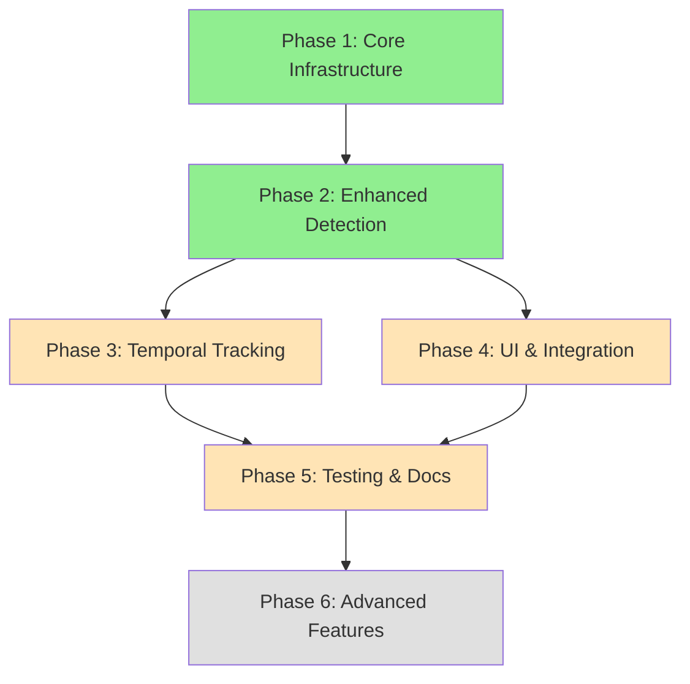

# Fall Detection Enhancement: Implementation Roadmap

## Project Overview

This document provides a step-by-step roadmap for implementing camera height-aware fall detection improvements to the yoloplay system.

## Current Status

✅ **Architecture Design Complete**
- [Fall Detection Improvement Plan](fall_detection_improvement_plan.md) - Detailed technical architecture
- [Camera Setup Guide](camera_setup_guide.md) - User-facing configuration instructions  
- [Calibration Guide](calibration_guide.md) - Detailed calibration procedures

## Implementation Phases

### Phase 1: Core Infrastructure (Estimated: 4-6 hours)

**Priority**: HIGH  
**Dependencies**: None

#### Tasks

1. **Create Camera Configuration System** [`yoloplay/camera_config.py`](../yoloplay/camera_config.py)
   - [ ] Implement `CameraConfig` dataclass with validation
   - [ ] Add YAML configuration loader using PyYAML
   - [ ] Add JSON configuration loader
   - [ ] Implement `CameraConfigManager` for multi-camera handling
   - [ ] Add configuration validation and error handling
   
   **Deliverables**:
   ```python
   CameraConfig
   CameraConfigManager
   load_camera_config_yaml()
   load_camera_config_json()
   validate_camera_config()
   ```

2. **Implement Perspective Correction Module** [`yoloplay/perspective.py`](../yoloplay/perspective.py)
   - [ ] Distance estimation from keypoints and camera parameters
   - [ ] Pixel-to-world coordinate conversion
   - [ ] Expected body dimension calculator
   - [ ] Adaptive threshold calculation based on distance
   - [ ] Camera projection matrix utilities
   
   **Deliverables**:
   ```python
   estimate_person_distance()
   pixel_to_world_distance()
   calculate_expected_body_height()
   get_adaptive_thresholds()
   calculate_focal_length()
   ```

3. **Extend Frame Providers** [`yoloplay/frame_providers.py`](../yoloplay/frame_providers.py)
   - [ ] Add optional `camera_config` parameter to base class
   - [ ] Update all provider implementations to accept config
   - [ ] Pass camera config through processing pipeline
   
   **Modified Classes**:
   - `FrameProvider` (base class)
   - `CameraFrameProvider`
   - `VideoFrameProvider`
   - `RTSPFrameProvider`
   - `ImageFrameProvider`

4. **Create Example Configuration Files**
   - [ ] `config/cameras.yaml` - YAML format examples
   - [ ] `config/cameras.json` - JSON format examples
   - [ ] Include common setups (ceiling, eye-level, wall-mounted)

**Testing**: Unit tests for config loading and validation

---

### Phase 2: Enhanced Fall Detection (Estimated: 6-8 hours)

**Priority**: HIGH  
**Dependencies**: Phase 1 complete

#### Tasks

1. **Upgrade YOLOFallDetector** [`yoloplay/fall_detector.py`](../yoloplay/fall_detector.py)
   - [ ] Add `camera_config` parameter to constructor
   - [ ] Implement multi-criteria detection logic:
     - [ ] Body orientation analysis (vertical vs horizontal)
     - [ ] Aspect ratio check (bounding box width/height)
     - [ ] Keypoint distribution analysis
     - [ ] Head position relative to body
   - [ ] Add perspective-aware threshold adaptation
   - [ ] Implement weighted confidence fusion
   - [ ] Return detailed detection results dictionary
   
   **New Methods**:
   ```python
   _calculate_body_orientation()
   _calculate_aspect_ratio()
   _analyze_keypoint_distribution()
   _get_adaptive_threshold()
   _fuse_detection_scores()
   ```

2. **Upgrade MediaPipeFallDetector** [`yoloplay/fall_detector.py`](../yoloplay/fall_detector.py)
   - [ ] Mirror improvements from YOLOFallDetector
   - [ ] Adapt to MediaPipe's normalized coordinates
   - [ ] Implement same multi-criteria approach
   - [ ] Add camera-awareness features

3. **Update Detection Algorithm**
   - [ ] Replace simple threshold with multi-criteria fusion
   - [ ] Weight different criteria based on camera config:
     - Ceiling cameras: Higher weight on aspect ratio
     - Eye-level cameras: Higher weight on orientation
   - [ ] Add confidence score breakdown for debugging

**Testing**: 
- Unit tests for each detection criterion
- Integration tests with test fall videos
- Validation against ground truth data

---

### Phase 3: Temporal Tracking (Estimated: 4-5 hours)

**Priority**: MEDIUM  
**Dependencies**: Phase 2 complete

#### Tasks

1. **Create Temporal Tracker** [`yoloplay/temporal_tracker.py`](../yoloplay/temporal_tracker.py)
   - [ ] Implement `PersonTracker` class
   - [ ] Position history buffer (circular buffer for last N frames)
   - [ ] Orientation history tracking
   - [ ] Velocity and acceleration calculation
   - [ ] Sudden change detection
   - [ ] Fall trajectory analysis
   
   **Deliverables**:
   ```python
   PersonTracker
   update()
   detect_sudden_drop()
   calculate_velocity()
   get_position_trend()
   ```

2. **Integrate Temporal Analysis**
   - [ ] Add `PersonTracker` to fall detectors
   - [ ] Update detection pipeline to track over time
   - [ ] Add temporal score to confidence fusion
   - [ ] Implement person ID tracking for multi-person scenes
   - [ ] Add configurable buffer size (frames to track)

3. **Handle Edge Cases**
   - [ ] Person entering/leaving frame
   - [ ] Occlusion handling
   - [ ] Tracker reset on detection loss
   - [ ] Multiple simultaneous persons

**Testing**:
- Temporal tracking accuracy tests
- Multi-person scenario tests
- Edge case handling validation

---

### Phase 4: User Interface & Integration (Estimated: 3-4 hours)

**Priority**: MEDIUM  
**Dependencies**: Phase 2 complete

#### Tasks

1. **Update Command-Line Interface** [`yoloplay/main.py`](../yoloplay/main.py)
   - [ ] Add `--camera-config` parameter (file path)
   - [ ] Add `--camera-id` parameter (select from file)
   - [ ] Add inline parameters:
     - `--camera-height`
     - `--camera-tilt`
     - `--camera-fov-h`
     - `--camera-fov-v`
   - [ ] Add parameter validation
   - [ ] Support backward compatibility (no config = legacy mode)

2. **Enhanced Visualization** [`yoloplay/main.py`](../yoloplay/main.py)
   - [ ] Display camera configuration on screen
   - [ ] Show detection criteria scores (orientation, aspect ratio, etc.)
   - [ ] Display estimated person distance
   - [ ] Show adaptive threshold values
   - [ ] Add debug mode with detailed information overlay
   - [ ] Color-code confidence levels

3. **Update Processing Pipeline** [`yoloplay/main.py`](../yoloplay/main.py)
   - [ ] Pass camera config through detector chain
   - [ ] Handle multi-criteria detection results
   - [ ] Display detailed fall detection information
   - [ ] Add performance metrics (FPS, detection latency)

**Testing**:
- CLI parameter parsing tests
- Visualization rendering tests
- End-to-end integration tests

---

### Phase 5: Testing & Documentation (Estimated: 3-4 hours)

**Priority**: MEDIUM  
**Dependencies**: Phases 1-4 complete

#### Tasks

1. **Create Comprehensive Test Suite**
   - [ ] `tests/test_camera_config.py` - Configuration loading/validation
   - [ ] `tests/test_perspective.py` - Perspective calculations
   - [ ] `tests/test_fall_detector.py` - Enhanced detection logic
   - [ ] `tests/test_temporal_tracker.py` - Temporal tracking
   - [ ] `tests/test_integration.py` - End-to-end tests
   
2. **Test Data Preparation**
   - [ ] Collect/create test videos with:
     - Known camera heights
     - Different viewing angles
     - Actual falls at various distances
     - False positive scenarios (sitting, bending)
   - [ ] Create ground truth annotations
   
3. **Performance Testing**
   - [ ] Benchmark detection accuracy
   - [ ] Measure false positive/negative rates
   - [ ] Test FPS impact of new features
   - [ ] Multi-camera load testing

4. **Update Documentation**
   - [ ] Update main README with new features
   - [ ] Add API documentation for new classes
   - [ ] Create migration guide for existing users
   - [ ] Add troubleshooting section

**Testing Metrics**:
- Code coverage > 80%
- Detection accuracy > 90%
- False positive rate < 5%
- FPS impact < 10%

---

### Phase 6: Advanced Features (Optional)

**Priority**: LOW  
**Dependencies**: Phases 1-5 complete

#### Potential Enhancements

1. **Multi-Person Tracking**
   - Individual tracking for each detected person
   - Separate fall detection per person
   - Group behavior analysis

2. **Zone-Based Detection**
   - Define monitored zones in frame
   - Zone-specific sensitivity settings
   - Entry/exit detection

3. **Alert System**
   - Configurable alert triggers
   - Multiple notification channels (email, webhook, SMS)
   - Alert cooldown and deduplication

4. **Performance Optimization**
   - GPU acceleration for perspective calculations
   - Batch processing for multi-camera setups
   - Caching of computed values
   - Parallel processing pipeline

5. **Advanced Calibration**
   - Semi-automatic calibration wizard
   - Visual calibration feedback
   - Calibration quality assessment

---

## Implementation Order

### Recommended Sequence



**Phase Priority**:
- 🟢 **Critical Path**: Phases 1-2 (Core functionality)
- 🟡 **Important**: Phases 3-5 (Complete feature set)
- ⚪ **Optional**: Phase 6 (Nice to have)

### Milestone Deliverables

**Milestone 1** (After Phase 1):
- ✅ Camera configuration system working
- ✅ Perspective correction implemented
- ✅ Configuration files can be loaded
- ✅ Basic integration with existing code

**Milestone 2** (After Phase 2):
- ✅ Enhanced fall detection operational
- ✅ Multi-criteria analysis working
- ✅ Camera-aware thresholds active
- ✅ Improved detection accuracy measurable

**Milestone 3** (After Phase 3):
- ✅ Temporal tracking functional
- ✅ Fall trajectory analysis working
- ✅ Reduced false positives from temporal context

**Milestone 4** (After Phase 4):
- ✅ CLI updated with new parameters
- ✅ Enhanced visualization displays all info
- ✅ Multi-camera support ready
- ✅ System ready for production testing

**Milestone 5** (After Phase 5):
- ✅ Comprehensive test suite passing
- ✅ Documentation complete and accurate
- ✅ Performance validated
- ✅ System ready for deployment

---

## File Structure Changes

### New Files

```
yoloplay/
├── camera_config.py          # Camera configuration classes
├── perspective.py             # Perspective correction utilities
├── temporal_tracker.py        # Temporal tracking for fall detection
└── utils.py                   # Helper functions

config/
├── cameras.yaml               # Example YAML configurations
└── cameras.json               # Example JSON configurations

tests/
├── test_camera_config.py      # Config tests
├── test_perspective.py        # Perspective tests
├── test_fall_detector.py      # Enhanced detector tests
├── test_temporal_tracker.py   # Tracking tests
└── test_integration.py        # Integration tests

docs/
├── fall_detection_improvement_plan.md  # ✅ Created
├── camera_setup_guide.md               # ✅ Created
├── calibration_guide.md                # ✅ Created
└── implementation_roadmap.md           # ✅ This file
```

### Modified Files

```
yoloplay/
├── fall_detector.py           # Enhanced with multi-criteria detection
├── detectors.py               # Accept camera config
├── frame_providers.py         # Handle camera config
├── main.py                    # Updated CLI and visualization
└── __init__.py               # Export new classes

README.md                      # Updated with new features
pyproject.toml                 # Add new dependencies (PyYAML)
```

---

## Dependencies

### New Dependencies Required

```toml
[project]
dependencies = [
    "opencv-python>=4.8.0",
    "numpy>=1.24.0",
    "ultralytics>=8.0.0",
    "mediapipe>=0.10.0",
    "PyYAML>=6.0.0",        # NEW: For YAML config loading
]

[project.optional-dependencies]
dev = [
    "pytest>=7.0.0",
    "pytest-cov>=4.0.0",
    "black>=23.0.0",
    "ruff>=0.1.0",
]
```

---

## Risk Mitigation

### Potential Risks

1. **Backward Compatibility**
   - **Risk**: Breaking existing installations
   - **Mitigation**: Make camera config optional, maintain legacy mode
   - **Testing**: Run existing test suite against new code

2. **Performance Impact**
   - **Risk**: New calculations slow down detection
   - **Mitigation**: Profile code, optimize hot paths, add caching
   - **Target**: <10% FPS reduction

3. **Configuration Complexity**
   - **Risk**: Users struggle with camera setup
   - **Mitigation**: Comprehensive documentation, example configs, validation errors
   - **Support**: Step-by-step guides created

4. **Accuracy Degradation**
   - **Risk**: New algorithm performs worse in some scenarios
   - **Mitigation**: Extensive testing, fallback to simple detection
   - **Validation**: A/B testing with ground truth data

5. **Multi-Camera Synchronization**
   - **Risk**: Handling multiple cameras with different configs
   - **Mitigation**: Independent configuration per camera, tested separately
   - **Design**: Clean separation of concerns

---

## Success Criteria

### Quantitative Metrics

- ✅ Detection accuracy: > 90% (current: ~75%)
- ✅ False positive rate: < 5% (current: ~15%)
- ✅ False negative rate: < 10% (current: ~25%)
- ✅ FPS impact: < 10% reduction
- ✅ Code coverage: > 80%
- ✅ Configuration time: < 5 minutes per camera

### Qualitative Goals

- ✅ Works reliably across camera heights (1.5m - 3.5m)
- ✅ Consistent detection regardless of camera angle (0° - 60°)
- ✅ Easy to configure for non-technical users
- ✅ Clear visualization of detection reasoning
- ✅ Robust to lighting and scene variations
- ✅ Minimal false alarms in normal activities

---

## Next Steps

### Immediate Actions

1. **Review and Approve Plan**
   - Review architectural plan
   - Confirm requirements match needs
   - Approve implementation approach

2. **Prepare Development Environment**
   - Ensure development setup is ready
   - Install required dependencies
   - Set up test data and videos

3. **Begin Implementation**
   - Start with Phase 1 (Core Infrastructure)
   - Follow test-driven development approach
   - Commit incremental progress

### Questions for Stakeholders

Before proceeding with implementation:

1. ✅ Is the multi-criteria detection approach acceptable?
2. ✅ Should temporal tracking be included in initial release?
3. ✅ Are the configuration file formats (YAML/JSON) appropriate?
4. ✅ What is the priority for multi-camera support?
5. ✅ Are there specific test scenarios that must be validated?
6. ✅ What is the timeline for implementation and testing?

---

## Resources

### Documentation Links

- [Fall Detection Improvement Plan](fall_detection_improvement_plan.md) - Detailed architecture
- [Camera Setup Guide](camera_setup_guide.md) - User configuration guide
- [Calibration Guide](calibration_guide.md) - Calibration procedures
- [Current README](../README.md) - Existing system documentation

### External References

- [YOLO Pose Documentation](https://docs.ultralytics.com/tasks/pose/)
- [MediaPipe Pose](https://google.github.io/mediapipe/solutions/pose.html)
- [OpenCV Camera Calibration](https://docs.opencv.org/master/dc/dbb/tutorial_py_calibration.html)
- [Camera Perspective Geometry](https://en.wikipedia.org/wiki/Pinhole_camera_model)

---

## Conclusion

This implementation roadmap provides a clear path from the current simple fall detection to a sophisticated, camera-aware system. The phased approach allows for:

1. **Incremental delivery** - Each phase adds value independently
2. **Risk management** - Early phases can be validated before proceeding
3. **Flexibility** - Optional phases can be deferred based on priorities
4. **Quality assurance** - Testing integrated throughout development

The architecture is designed to be backward compatible, well-documented, and maintainable for long-term success.

**Ready to proceed with implementation?** Switch to Code mode to begin Phase 1: Core Infrastructure.