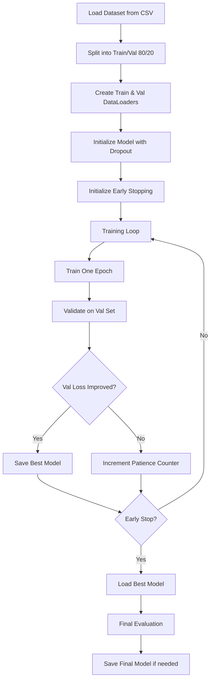

# Training Improvements Plan for Classification Model

## Overview
This plan addresses overfitting prevention in the pose classification training by implementing dataset splitting, early stopping, and regularization techniques.

## Current Issues
- No train/validation split - entire dataset used for training
- No early stopping - trains for fixed epochs regardless of performance
- No model checkpointing - only saves final model (may be overfitted)
- No dropout regularization in neural network
- Risk of overfitting, especially on small datasets

## Implementation Strategy

### 1. Dataset Splitting (80/20)
**Location:** [`train_model()`](yoloplay/classification.py:89) function

**Changes:**
```python
from sklearn.model_selection import train_test_split

# Split dataset into train and validation sets
train_indices, val_indices = train_test_split(
    range(len(dataset)),
    test_size=0.2,
    random_state=random_seed,
    stratify=labels  # Ensure balanced split
)

# Create subset datasets
train_dataset = torch.utils.data.Subset(dataset, train_indices)
val_dataset = torch.utils.data.Subset(dataset, val_indices)

# Create separate data loaders
train_loader = DataLoader(train_dataset, batch_size=batch_size, shuffle=True)
val_loader = DataLoader(val_dataset, batch_size=batch_size, shuffle=False)
```

**Benefits:**
- Validates model performance on unseen data
- Detects overfitting during training
- Provides realistic performance estimates

---

### 2. Early Stopping Implementation
**Location:** New `EarlyStopping` class before [`train_model()`](yoloplay/classification.py:89)

**Class Definition:**
```python
class EarlyStopping:
    """Early stopping to stop training when validation loss doesn't improve."""
    
    def __init__(self, patience=10, min_delta=0.0, mode='min'):
        self.patience = patience
        self.min_delta = min_delta
        self.mode = mode
        self.counter = 0
        self.best_score = None
        self.early_stop = False
        
    def __call__(self, val_loss):
        score = -val_loss if self.mode == 'min' else val_loss
        
        if self.best_score is None:
            self.best_score = score
        elif score < self.best_score + self.min_delta:
            self.counter += 1
            if self.counter >= self.patience:
                self.early_stop = True
        else:
            self.best_score = score
            self.counter = 0
        
        return self.early_stop
```

**Integration:**
- Initialize early stopping with patience=10
- Check after each validation epoch
- Stop training when triggered
- Report final epoch and reason for stopping

---

### 3. Model Architecture Enhancement
**Location:** [`NeuralNet`](yoloplay/classification.py:14) class

**Current Architecture:**
```python
Linear(34) -> ReLU -> Linear(256) -> Output(1)
```

**Enhanced Architecture with Dropout:**
```python
class NeuralNet(nn.Module):
    def __init__(self, input_size=34, hidden_size=256, num_classes=1, dropout_rate=0.5):
        super(NeuralNet, self).__init__()
        self.l1 = nn.Linear(input_size, hidden_size)
        self.relu = nn.ReLU()
        self.dropout = nn.Dropout(dropout_rate)
        self.l2 = nn.Linear(hidden_size, num_classes)
    
    def forward(self, x):
        out = self.l1(x)
        out = self.relu(out)
        out = self.dropout(out)  # Add dropout for regularization
        out = self.l2(out)
        return out
```

**Benefits:**
- Reduces overfitting by randomly dropping neurons during training
- Forces network to learn more robust features
- Configurable dropout rate (default: 0.5)

---

### 4. Training Loop Modifications
**Location:** [`train_model()`](yoloplay/classification.py:89) function

**Enhanced Training Loop:**
```python
# Initialize early stopping and best model tracking
early_stopping = EarlyStopping(patience=patience)
best_val_loss = float('inf')
best_model_path = model_path.replace('.pt', '_best.pt')

for epoch in range(epochs):
    # Training phase
    model.train()
    train_loss, train_acc = train_one_epoch(model, train_loader, ...)
    
    # Validation phase
    model.eval()
    val_loss, val_acc = validate(model, val_loader, ...)
    
    # Model checkpointing
    if val_loss < best_val_loss:
        best_val_loss = val_loss
        torch.save(model.state_dict(), best_model_path)
        print(f"Best model saved with val_loss: {val_loss:.4f}")
    
    # Early stopping check
    if early_stopping(val_loss):
        print(f"Early stopping triggered at epoch {epoch+1}")
        break
    
    # Print epoch statistics
    print(f"Epoch {epoch+1}/{epochs}")
    print(f"  Train - Loss: {train_loss:.4f}, Acc: {train_acc:.4f}")
    print(f"  Val   - Loss: {val_loss:.4f}, Acc: {val_acc:.4f}")
```

**Helper Functions:**
- `train_one_epoch()`: Training loop logic
- `validate()`: Validation loop logic

---

### 5. Command-Line Arguments
**Location:** [`main()`](yoloplay/classification.py:178) function

**New Arguments:**
```python
parser.add_argument(
    '--split-ratio', 
    type=float, 
    default=0.8,
    help='Train/validation split ratio (default: 0.8)'
)
parser.add_argument(
    '--patience', 
    type=int, 
    default=10,
    help='Early stopping patience in epochs (default: 10)'
)
parser.add_argument(
    '--random-seed', 
    type=int, 
    default=42,
    help='Random seed for reproducibility (default: 42)'
)
parser.add_argument(
    '--dropout', 
    type=float, 
    default=0.5,
    help='Dropout rate for regularization (default: 0.5)'
)
parser.add_argument(
    '--save-best-only',
    action='store_true',
    help='Only save the best model (default: False)'
)
```

---

### 6. Model Checkpointing Strategy

**Files Saved:**
1. `{model_path}_best.pt` - Best model based on validation loss (always)
2. `{model_path}` - Final model at end of training (optional, controlled by `--save-best-only`)

**Metadata Saved:**
```python
checkpoint = {
    'epoch': epoch,
    'model_state_dict': model.state_dict(),
    'optimizer_state_dict': optimizer.state_dict(),
    'train_loss': train_loss,
    'val_loss': val_loss,
    'train_acc': train_acc,
    'val_acc': val_acc,
}
```

---

## Implementation Workflow



---

## Expected Outcomes

### Before Implementation:
- ❌ Model trains on entire dataset
- ❌ No way to detect overfitting
- ❌ May train unnecessarily long
- ❌ Saves potentially overfitted model

### After Implementation:
- ✅ 80% data for training, 20% for validation
- ✅ Monitors validation loss each epoch
- ✅ Stops when no improvement for 10 epochs
- ✅ Saves best model based on validation performance
- ✅ Dropout regularization reduces overfitting
- ✅ Clear metrics showing train vs validation performance

---

## Testing Strategy

1. **Create test dataset** with known overfitting scenario
2. **Train without improvements** - observe overfitting
3. **Train with improvements** - verify early stopping works
4. **Compare models** - best vs final
5. **Validate metrics** - ensure train/val split is correct

---

## Usage Examples

### Basic usage (with defaults):
```bash
yoloplay_train --csv data/train.csv --model-path models/pose_classification.pt
```

### Custom configuration:
```bash
yoloplay_train \
  --csv data/train.csv \
  --model-path models/pose_classification.pt \
  --split-ratio 0.7 \
  --patience 15 \
  --dropout 0.3 \
  --epochs 200 \
  --save-best-only
```

### Expected output:
```
Training on device: cuda
Loaded 1000 samples from CSV
Train set: 800 samples, Val set: 200 samples

Epoch 1/200
  Train - Loss: 0.6931, Acc: 0.5125
  Val   - Loss: 0.6823, Acc: 0.5300
Best model saved with val_loss: 0.6823

Epoch 2/200
  Train - Loss: 0.5234, Acc: 0.7450
  Val   - Loss: 0.5456, Acc: 0.7150
Best model saved with val_loss: 0.5456

...

Epoch 45/200
  Train - Loss: 0.1234, Acc: 0.9625
  Val   - Loss: 0.3456, Acc: 0.8650
Early stopping triggered at epoch 45

Best model (epoch 35) saved to models/pose_classification_best.pt
Final model saved to models/pose_classification.pt
```

---

## Dependencies

All required dependencies already in [`pyproject.toml`](pyproject.toml:1):
- ✅ `torch` - PyTorch framework
- ✅ `scikit-learn` - For `train_test_split`
- ✅ `numpy` - Array operations

No additional dependencies needed.

---

## File Modifications Summary

| File | Changes |
|------|---------|
| [`classification.py`](yoloplay/classification.py:1) | Add EarlyStopping class, modify NeuralNet with dropout, update train_model() with validation loop, add new CLI arguments |

---

## Risk Mitigation

**Risk:** Small datasets may not split well
- **Mitigation:** Use stratified split to maintain class balance
- **Mitigation:** Add warnings for very small datasets (<100 samples)

**Risk:** Early stopping might stop too early
- **Mitigation:** Configurable patience parameter
- **Mitigation:** Track best model, can always continue training

**Risk:** Validation set too small
- **Mitigation:** Configurable split ratio
- **Mitigation:** Minimum validation set size validation

---

## Future Enhancements (Optional)

1. **K-Fold Cross-Validation** - More robust evaluation for small datasets
2. **Learning Rate Scheduling** - Reduce LR when validation loss plateaus
3. **Data Augmentation** - Keypoint augmentation for more training variety
4. **TensorBoard Logging** - Visualize training progress
5. **Automated Hyperparameter Tuning** - Find optimal dropout, learning rate, etc.